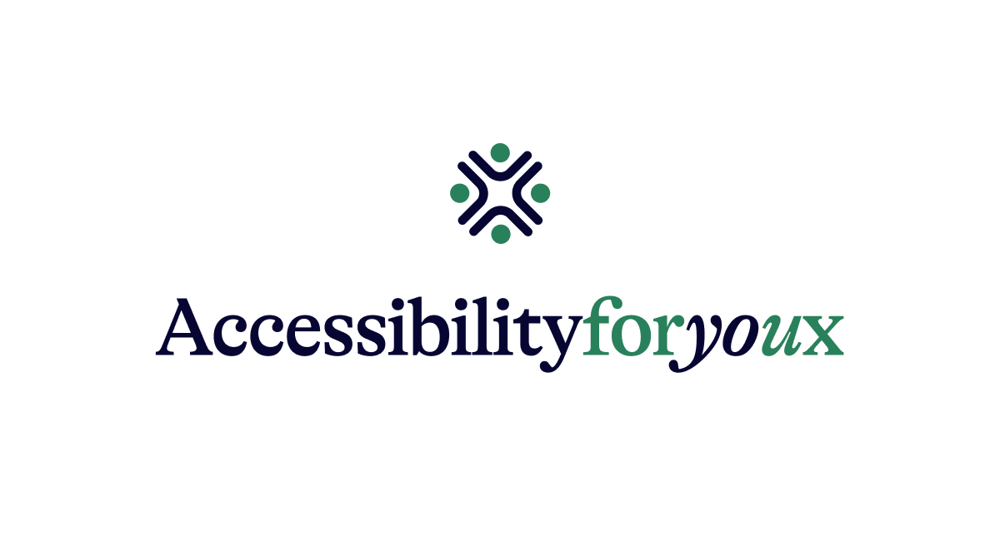

  

# AccessibilityForYoux

A beginner-oriented web platform teaching the fundamentals of digital accessibility.

This project was created as a Bachelor's degree thesis in graphic design for the academic year 2025–2026. It breaks down complex technical guidelines into an approachable, practical resource for junior developers, design students, and career changers.

## Features & Principles

- **Progressive Disclosure:** Surfaces only necessary information at each step.
- **Plain Language First:** Avoids jargon and defines terms when they first appear.
- **Practice What You Preach:** The platform itself models accessibility, achieving WCAG 2.2 AA compliance across all pages.
- **Practical examples and illustrations** Make the educational content easy to understand and visualize, and have users experience it first-hand.
- Tested with Wave, Chrome Lighthouse, and screen readers (NVDA, VoiceOver).

## Tech Stack

- Next.js (SSR, routing)
- JavaScript
- React
- Tailwind CSS

## Links

- **Live Site:** [accessibilityforyoux.org](https://accessibilityforyoux.org)
- **Personal Website:** [pierlucadesign.xyz](https://pierlucadesign.xyz)

## Project Status & Contributing

This repository is public so others can view the code and learn from it. However, this is a solo academic project by Pierluca Bruni, and I am not accepting external contributions, feature requests, or pull requests at this time.

## Contact

- **Email**: hello@pierlucadesign.com

## License

This project is licensed under the **Creative Commons Attribution-NonCommercial-NoDerivs 4.0 International (CC BY-NC-ND 4.0)**.

- **You are free to** share and redistribute the material.
- **Under the following terms**: You must give credit to Pierluca Bruni, you may not use the material for commercial purposes, and you may not distribute modified versions of the project.

---

© 2026 Pierluca Bruni - AccessibilityForYoux
